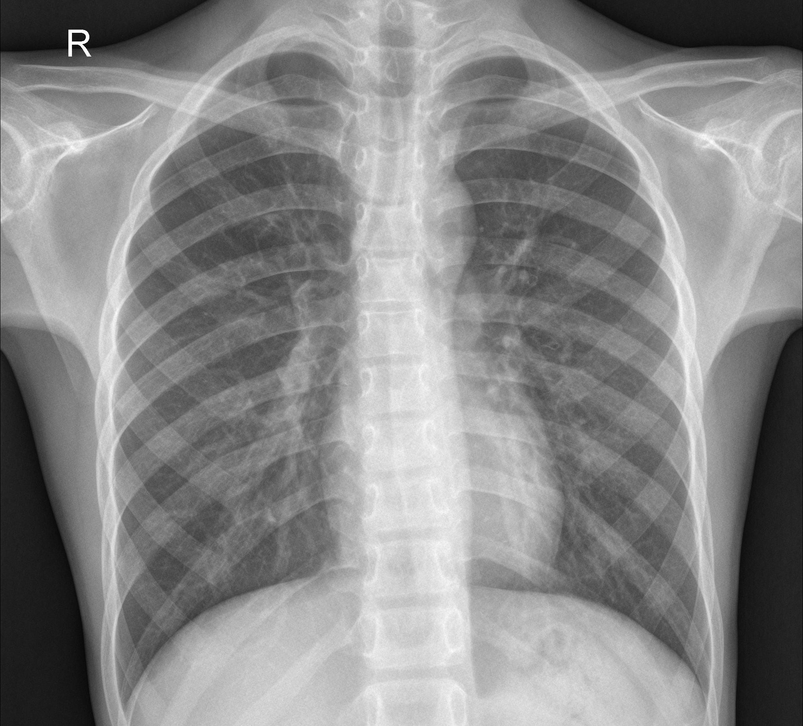

# Pneumonia Detection using Deep Learning

This project implements a pneumonia detection system using chest X-ray images and deep learning. It uses a fine-tuned ResNet50 model to classify chest X-ray images as either normal or showing signs of pneumonia.


## Dataset

The project uses the Chest X-Ray Images (Pneumonia) dataset from Kaggle. The dataset contains chest X-ray images categorized into two classes: NORMAL and PNEUMONIA.

### Dataset Setup

1. Create a `dataset` folder in the project root directory
2. Download the dataset using one of these methods:
   - **Using Kaggle API** (recommended):
     ```python
     from kaggle.api.kaggle_api_extended import KaggleApi
     import os
     api = KaggleApi()
     api.authenticate()
     api.dataset_download_files('paultimothymooney/chest-xray-pneumonia', path='dataset', unzip=True)
     ```
   - **Manual Download**:
     1. Download from [Kaggle](https://www.kaggle.com/datasets/paultimothymooney/chest-xray-pneumonia)
     2. Extract the contents into the `dataset` folder

## Requirements

```
torch
torchvision
PIL
kaggle
```

## Project Structure

```
.
├── dataset/
│   └── chest_xray/
│       ├── train/
│       ├── test/
│       └── val/
├── main.ipynb
└── README.md
```

## Model Architecture

The model uses a pre-trained ResNet50 backbone with a custom classifier head:
- ResNet50 pretrained on ImageNet
- Custom classifier with multiple fully connected layers
- Dropout layers for regularization
- Batch normalization for training stability

## Training

The model is trained with:
- Binary Cross Entropy Loss with logits
- Adam optimizer
- Learning rate: 1e-3
- Weight decay: 1e-5
- Batch size: 32

## Usage

1. Install the required dependencies
2. Set up the dataset as described above
3. Run the Jupyter notebook `main.ipynb`

## License

This project uses the MIT License - see the LICENSE file for details.

## Acknowledgments

- Dataset: [Chest X-Ray Images (Pneumonia)](https://www.kaggle.com/datasets/paultimothymooney/chest-xray-pneumonia)
- Base model: [ResNet50](https://arxiv.org/abs/1512.03385)